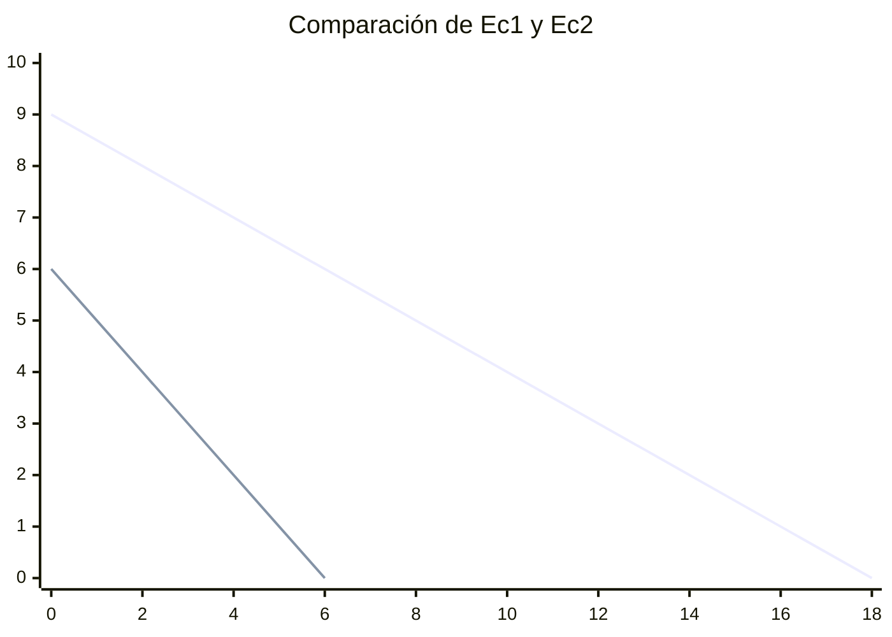
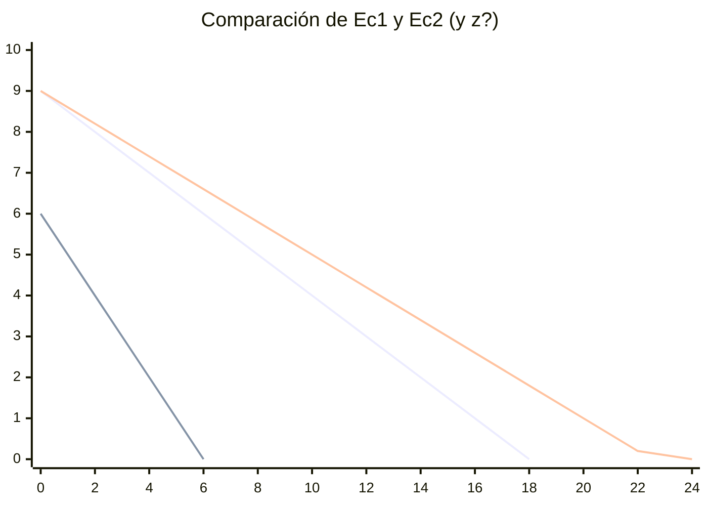
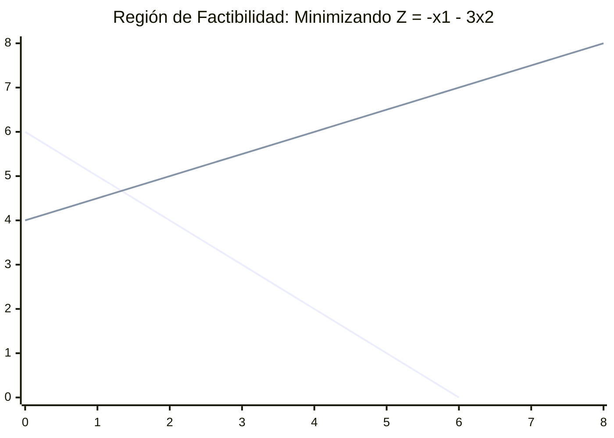

# 📝 Historia  y Primer Problema
**Fecha:** 24 de Marzo de 2026  
**Materia/Módulo:** Optimización Determinista Modulo 1  
**Profesor(a):** Fernando Elizalde  

---

## 🧠 Teoría y Conceptos Principales
Programación lineal y prgramación entera.  

Tambien existen procesos estocásticos. Se usan para:
- Análisis Financieros
- Cadenas de Markov
---
Programación dinámica:
- Algunas redes neuronales funcionan con PD
- Secuencias de paso
- Muchos de problemas de programación entera, se pueden resolver con PD
- Problemas de transporte
- Es como las integrales, las funciones se pueden integrar de diferentes formas
---

Algoritmos exactos:
- Están limitados al problema
- Son condiciones y restricciones muy específicas
---
Heuríticos:
- Griding
- Solución que cumple con mis restricciones
- NO garantiza el óptimo (griding)
- Solo es una solución
---
Metaheurístico (MH):
- Para el MH, necesitas el H    
    - Dentro de los MH, están los algorítmos inspirados (los de animalitos)
        - Están vendidos como IA, pero no son.
---
Optimización Estocástica:
- Es para líneal y para entera
- Lo que cambia es que los parámetros son aleatorios
---
Optimización no lineal:
- No garantizas optimalidad
- Los algoritmos se mueren
- Necesitas metodos de lagrange, sistemas de eq, etc...
- Se tratan de evitar
---
Optimización multiobjetivo:
- una característica clave es que no suele haber una única solución óptima, sino un conjunto de soluciones de compromiso (frente de Pareto).
--- 
Teoría de juegos:
- una característica clave es la interdependencia estratégica: lo que le conviene a cada jugador depende de lo que hagan los demás.
---
Satisfacción de restricciones:
- La gente casi no la usa porque no le pones función objetivo, o simplemente la dejas a 0
- Cuando tienes modelos grandes o complicados, te da una solución "medio" buena
- Se la puedes dar a un metaheurístico y te la mejora
---

Por el momento nos apegaremos a P.Lineal, porque con eso garantizamos optimalidad.
Lo metaheuríticos son aproximción.
Búsqueda local, NO ES IA.

### Si sabes programación lineal bien, YA CON ESO.

Hay que buscar trabajar con desigualdades, ya en el peor de los casos, le pones una igualdad.

## Historia

Dantzing - El que llegó al salón, y pensó que era tarea unos problemas que no se habían resuelto en un chingo de tiempo. (~200 años)

Fue durante 1920-1950

Habia un ruso mamalon, que tambien lo hiz - L. V. Kantorovich 

Dantzing planteó un problema de entrenamientio y abastecimiento logístico para la fuerza aerea

Kantorovich lo había hecho en el 1939 creo.

## Definiciones básicas
Trabajaremos en el primer cuadrante

Minimizar:  
$c_1x_1+c_2x_2+...c_nx_n$

Los coeficientes son costos ($c_n$), no son costos como tal, solo son definición, así le puso el señor.

Sujeto a:   
$a_{11}x_1+a_{12}x_2+...a_{1n}x_n \geq b_1$  
$a_{21}x_1+a_{22}x_2+...a_{2n}x_n \geq b_2$  
...  
$a_{m1}x_1+a_{m2}x_2+...a_{mn}x_n \geq b_m$   
$x_1,x_2,...,x_n \geq 0$

Ésto es un vector de recursos
---

$min(cx)$  
$Ax \geq b$  
$x \geq 0$   

Pensarlo como cordenadas, si tus coordenadas están dentro de las desigualdades, entonces son factibles.

Si estás trabajando con un MH, está bien tener infactibles.

## Problema 1
Min $2x_1+5x_2$

s.a:  
$-x_1-2x_2 \geq -18=Ec_1$     
$x_1+x_2 \geq 6 = Ec_1$       
$x_1,x_2 \geq 0$

Igualdad, solo porque es método gráfico y no matemático, para graficarlo

### EQ 1
$-x_1-2x_2 = -18$  
Si $x_1=0, $x_2=9 -> (0,9)$   
Si $x_2=0, $x_1=18 -> (18,0)$
___
### EQ2
$x_1+x_2 \geq 6$    
Si $x_1=0; x_2 = 6 -> (0,6)$   
Si $x_2=0; x_1 = 6 -> (6,0)$

$Ec_1=-x_1-2x_2=-18$   
$Ec_2=x_1+x_2=6$

curva de nivel = rayo de soluciones

$\nabla Ec_1 = \begin{bmatrix} \frac{2}{x_1}(-x_1, -2x_2) \\ \frac{2}{2x_2}(-x_1-2x_2) \end{bmatrix} = \begin{bmatrix} -1 \\ -2 \end{bmatrix}$

Para la EQ2, mi región factible es el espacio entrela linea azul (Ec2) y la verde (Ec1)

$\nabla Ec_1 = \begin{bmatrix} 1 \\ 1 \end{bmatrix}$

Cuando haces programación lineal, no es solo redondear y ya, porque puede violar la restricción, hay qe saber para donde redondear.

Por ahora tenemos la región factible, y tenemos infinitas soluciones.

### ¿Cuál es la mejor solución?

Si yo resuelvo el sistema $Ax \geq b -> Ax = b$ me dará en intersecciones

Cada una de las vertices, (intersecciones), son soluciones posibles/factibles.

No tenemos soluciones infinitas, sino múltiples, y finitas.

$z(6,0) = 2(6)+5(0)=12$    
$z(0,6) = 2(0)+5(6)=30$   
$z(0,9)=2(0)+5(9)=45$   
$z(18,0)=2(18)+5(0)=36$    

Como estoy minimizando, pues sería el $z(6,0) = 12$, porque es el menor.

La solución óptima $z^*=12$ se obtiene por la combinación $(x^*,y^*)=(6,0)$

$z(0,9)=45$  
$zx_1+5x_2=45$   
Si $x_1=0; x_2=9$   
Si $x_2=0; x_1=22.5$   

$\nabla z = \begin{bmatrix} 2 \\ 5 \end{bmatrix}$

El gradiente de las restricciones, dice cuál es la región factible para ellas.

La roja es la de z, y su gradiente.

---
## Hipótesis de Programación Lineal

Hay algoritmos que te piden que a fuerzas tengan una dirección específica los vectores/desigualdades.

Por ejemplo:

$x_1+x_2 \geq 6 $

Multiplico por -1  

$-x_1-x_2 \leq -6$

$Ax \geq 6 -> Ax = 6$   
$x_1+x_2 \geq 6 $   
$x_1+x_2=6$

Usaría: $x_1=5; x_2=7$

Suponiendo que sí son 5 y 7

$5 + 7 = 6$

Pues no, está mal lolazo

Le añadimos un -6, para que sí sea correcto, se llama variable de exceso.  
Y si fuera al revés, que en vez de restar fuera sumar, sería variable de holgura. 

## Ejemplo 1:
$min(-x_1-3x_2)$  
s.a:   
    $x_2+x_2 \leq 6 $ (1)   
    $-x_1+2x_2 \leq 8$ (2)     
    $x_1,x_2 \geq 0$ (3)   

Empezar a resolver:   
$x_1 + x_2 = 6$ -> $Ec_1$    
    Si $x_1=0;x_2=6$ -> (0,6)$     
    Si $x_2=0;x_1=6$ -> (6,0)$    

$-x_1 + 2x_2 = 8$ -> $Ec_2$    
    Si $x_1=0;x_2=4$ -> (0,4)$     
    Si $x_2=0;x_1=-8$ -> (-8,0)$    

$\color{blue}{\text{Linea Azul}}$ Ec1  
$\color{green}{\text{Linea Verde}}$ Ec2

$\nabla Ec_1 = \begin{bmatrix} 1 \\ 1 \end{bmatrix}$   

$\nabla Ec_2 = \begin{bmatrix} -1 \\ 2 \end{bmatrix}$

$\nabla z = \begin{bmatrix} -1 \\ -3 \end{bmatrix}$

$(6,0)$ Queda infactible

$x_1+x_2=6$   
$-x_1+2x_2=8$

$3x_2=14$  
$x_2=\frac{14}{13}$

$x_1=6-x_2$   
$x_1=6-\frac{14}{13}$   
$x_1=\frac{4}{3}$

$z(0,0) = -(0) - 3(0) = 0$  
$z(0,4) = -(0) -3(4) = -12$      
$z(\frac{4}{3},\frac{14}{3}) = -\frac{4}{3} - 3(\frac{14}{3}) = -\frac{46}{3}$   
$z(0,6) = - 0 -3(6)=-18$  

$z^*(0,6) = -18$

## Contenido / Teoría
Solución optima finita única. Ocurre en un punto extremo.

Solución óptima finita múltiple. Los dos vertices $x_1^*$ y $x_2^*$ son óptimos, así como cualquier punto sobre el segmento de recta que los une. Cualquier punto sobre el rayo con vértice $z^*$ es óptimo.

Sección óptima no acotada o ilimitada. La región factible y la solución óptima no están acotadas. Para un problema de minimización, el plano $cx=z$ se puede mover indefinidamente en dirección de -c, intersecando siempre en la región factible. El objetivo óptimo es no acotado con valor de $-\infin$ 

Solución infactible. Se tiene una solución infactible cuando se pueden encontrar una o más soluciones factibles.

Región factible vacía o solución inexistente. El sistema de ecuaciones y/o desigualdades que definen la región factible es incosistente.

---

### Restricciones activas y pasivas

Cuando en una restricción se consume el 100% de los recursos disponibles, osea, cuando una restricción realmente restringe (la ecuación es igual al valor del recurso), se denomina restricción activa. Por el contrario, cuando una restricción no restringe, y por tanto, existe un ocio asociado con la misma, se le llama restricción pasiva. 

Restricciones pasivas se pueden subdividir en redundante y necesarias. Geométricamente, una pasiva es necesaria si conforma una de las caras de la región factible, y es redundante si no es parte del espacio de solución.

## 💻 Solución y Código

## ✍️ Desarrollo en Papel (Talacha)
Niente

## 💡 Notas extra / Holgura / Dudas
* Niente